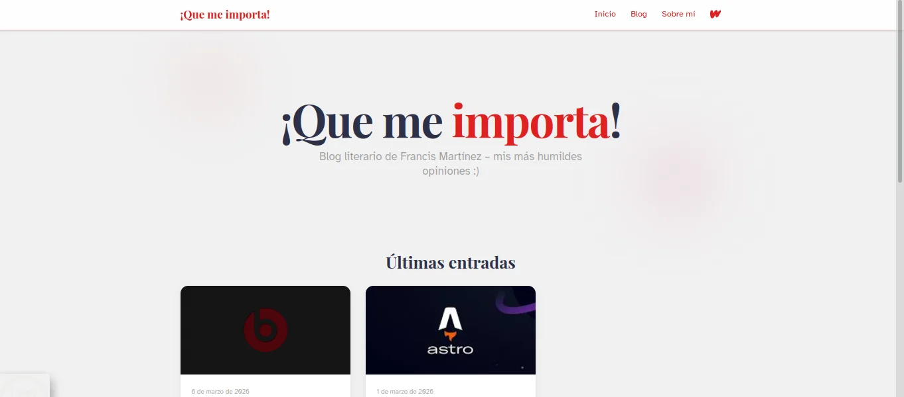
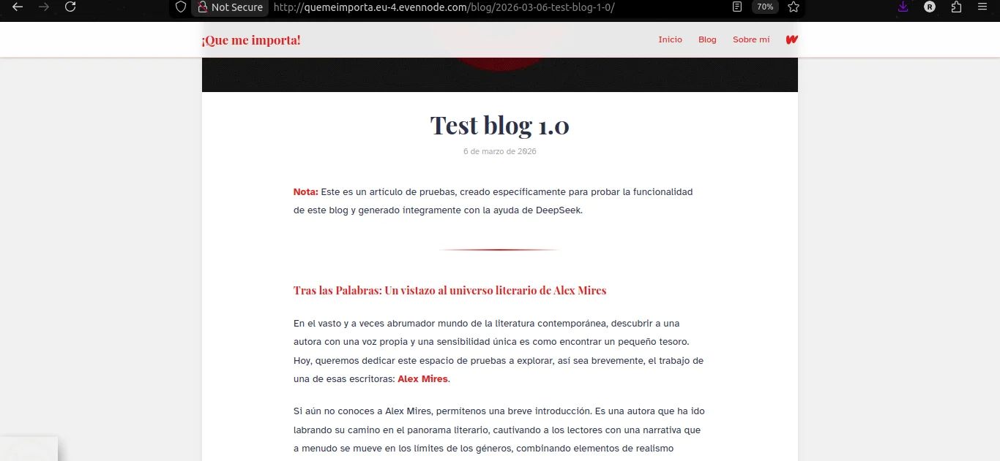
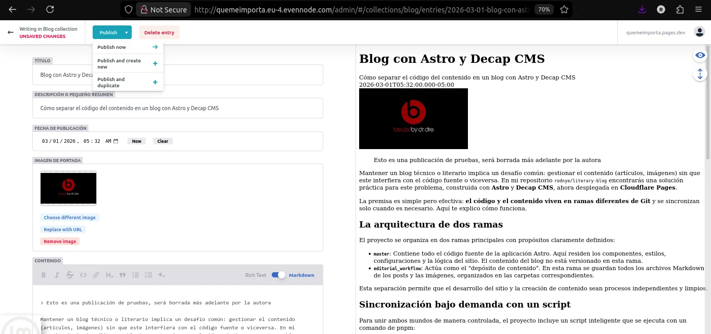

<center>

# Literary Blog


  
  
</center>

---

Website built with Astro. The repository separates source code from content through a workflow based on two branches and an update script.

## Branches

- **master** – Astro application source code.
- **editorial_workflow** – Blog content (markdown and images).

## Content workflow

Content is managed in isolation. In `master` there is a script that downloads a ZIP from the `editorial_workflow` branch and copies it to the corresponding directories (`src/content`, `src/assets/images`), respecting nested `.gitignore` files to avoid versioning the content.

```bash
pnpm blog:sync
```

## CMS and authentication

- **Decap CMS** interface available at `/admin\*\* for content editing and management. This route provides access to the administrative dashboard where authorized users can create, edit, and publish blog posts without touching the codebase.



- **Decap Bridge** manages identity login with GitHub for secure authentication.

Changes made through the CMS are automatically committed to the `editorial_workflow` branch.

For detailed configuration options, customizations, and authentication setup, refer to the official **[Decap CMS Documentation](https://decapcms.org/docs/)**.

## Available at:

- Evennode: http://quemeimporta.eu-4.evennode.com/
- Render: https://quemeimporta.onrender.com
- Vercel: https://quemeimporta.vercel.app
- Netlify: https://quemeimporta.netlify.app
- Cloudflare Pages: https://quemeimporta.pages.dev
- Deno Deploy: https://quemeimporta.rodnye.deno.net/
- Github Pages: https://rodnye.github.io/literary-blog/

## Local installation

```bash
git clone https://github.com/rodnye/literary-blog.git
cd literary-blog
pnpm install
pnpm blog:sync # Optional, but the blog will be empty
pnpm dev
```

---

Useful links:

- [Astro Docs](https://astro.build)
- [Decap CMS Documentation](https://decapcms.org/docs/)
